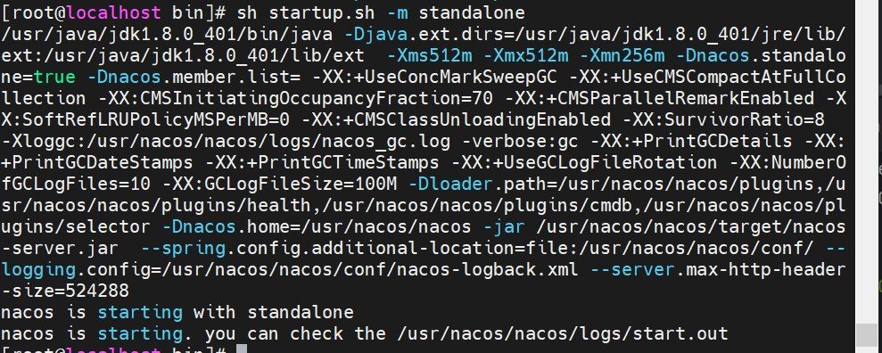
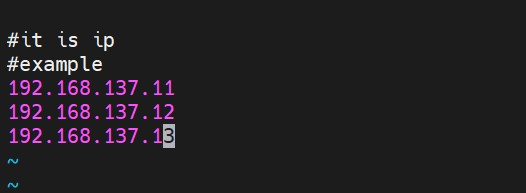

<!--content-->
## 单点Nacos环境准备

### linux虚拟机
* 只安装一台即可
https://blog.csdn.net/u012558695/article/details/133942384

### jdk安装
https://blog.csdn.net/LIU_ZHAO_YANG/article/details/129029072

### Nacos安装
https://github.com/alibaba/nacos/releases

#### 1)获取安装包


#### 2)上传到虚拟机上解压安装包
``` tar -zxvf nacos-server-2.3.0.tar.gz ```

#### 3)nacos 目录

```
 bin 保存启用/关闭Nacos Server脚本
 conf Nacos Server配置目录
 data Nacos 数据目录
 logs 存放日志目录
 target Nacos Jar包存放目录
``` 

#### 4）单点方式启动Nacos

``` 
 cd nacos/bin
 sh startup.sh -m standalone
 ```


* 启动成功日志如下：


#### 5）默认CentOs系统并没有对外开放7848/8848端口，需要设置防火墙对这两个端口进行释放
```
 7748端口：nacos集群通讯端口，用于nacos集群之间选举决策
 8848端口：nacos对客户端提供服务端口
 firewall-cmd  --zone=public  --add-port=8848/tcp --permanent
 firewall-cmd  --zone=public  --add-port=7748/tcp --permanent
 firewall-cmd --reload
```
#### 6）进入Nacos管理界面
* http://192.168.137.11:8848/nacos

* ip地址为自己虚拟机的地址，用户名密码默认都为 nacos

#### 7）idea新建springboot项目
#### 8) 启动springboot项目后，启动成功后，看到启动日志中如下日志，则注册到Nacos成功，我项目中的provider端口设置的为8070
``` nacos registry, DEFAULT_GROUP service-provider 10.56.69.12:8070 register finished ```
#### 9）查看nacos注册中心服务列表


## 集群Nacos环境准备
* 五台虚拟机，三台分别部署nacos，一台部署nginx做负载均衡，一台部署mysql数据库

| 系统版本     | 机器ip | 部署应用 | 应用版本  |
|---|---|---|-------|
|  CentOS 7 |192.168.137.11|Nacos| 2.3.0 |
|  CentOS 7 |192.168.137.12|Nacos| 2.3.0 |
|  CentOS 7 |192.168.137.13|Nacos| 2.3.0 |
|  CentOS 7 |192.168.137.14|Ngnix|       |
|  CentOS 7 |192.168.137.15|Mysql| 5.7   |

### linux虚拟机
* 安装三台虚拟机备用
https://blog.csdn.net/u012558695/article/details/133942384
### jdk安装
* nacos安装包下载以及解压同Nacos单点环境准备
### 虚拟机安装mysql
https://blog.csdn.net/u012558695/article/details/134061277
### 虚拟机安装ngnix
* 安装依赖
  ``` yum -y install gcc zlib zlib-devel pcre-devel openssl openssl-devel ```
  * 下载并解压安装包
    ```
    cd /usr/local
    mkdir nginx
    cd nginx
    wget http://nginx.org/download/nginx-1.24.0.tar.gz
        如果报错wget not find，则安装wget命令后再次运行命令下载tar包
           yum install wget -y
    压缩包解压: tar -xvf nginx-1.24.0.tar.gz
    ```
    * 安装nginx
        ```
      cd /usr/local/nginx
      cd nginx-1.24.0
      执行命令： ./configure
      执行make命令：make
      执行make install命令：make install
      ``` 
    * 修改nginx配置，为了防止一些乱码问题，我们尽量用vim打开，vim命令如果不存在，则安装下vim
    * 安装vim
    ```angular2html
    yum -y install vim*
    ```
    * 安装nat
    * vim /usr/local/nginx/nginx-1.24.0/conf/nginx.conf
   ```shell
       worker_processes  1;


      events {
      worker_connections  1024;
      }


      http {
      include       mime.types;
      default_type  application/octet-stream;

  
      sendfile        on;
    
      keepalive_timeout  65;


      upstream nacos-cluster{
      server 192.168.137.11:8848;
      server 192.168.137.12:8848;
      server 192.168.137.13:8848;
                }
      server {
          listen       8090;
          server_name  192.168.137.15;

    
        location / {
            root   html;
            index  index.html index.htm;
                proxy_pass http://nacos-cluster;
        }

     
        error_page   500 502 503 504  /50x.html;
        location = /50x.html {
            root   html;
        }
   } 
  ```

### 初始化 nacos 必须的数据库表并配置
* 找到conf目录下的mysql的数据库脚本文件 cd /usr/nacos/conf ，不同版本的nacos，数据库脚本文件名称可能有差异

* 切换到MySQL服务器上，启动mysql服务，并实例创建 nacos_config 库并导入下载下来的脚本


* 修改修改 Nacos 配置文件，指向 MySQL 实例，替换其内嵌数据库，三台nacos都进行此操作

* 切换Nacos内嵌数据库平台为MySQL
  ```
    spring.datasource.platform=mysql

    db.num=1

    ### Connect URL of DB:
    db.url.0=jdbc:mysql://192.168.137.14:3306/nacos_config?characterEncoding=utf8&connectTimeout=1000&socketTimeout=3000&autoReconnect=true&useUnicode=true&useSSL=false&serverTimezone=UTC
    db.user.0=root
    db.password.0=2wsx@4321

    ```

### nacos 集群配置
* 复制cluster.conf文件
 ```
  cp cluster.conf.example cluster.conf
  vi cluster.conf
```

 三台 nacos 实例都需要做以上集群配置，至此关于 nacos 的配置结束了，可以尝试以集群模式启动三个 nacos 实例了
### 以集群模式分别启动三个 nacos 实例
```angular2html
./startup.sh -m cluster
```

* 随便访问一台nacos
http://192.168.137.12:8848/nacos/login

 - 启动失败了说明，查看启动日志

 - - 连接数据库失败，我们自己测试直接防火墙关掉来解决这个问题
```angular2html
    systemctl stop firewalld
```
 - - 三台机器都关闭防火墙后重新启动所有服务器的nacos，出现如下日志代表启动成功


* 再次访问
  http://192.168.137.13:8848/nacos/#/configurationManagement?dataId=&group=&appName=&namespace=&pageSize=&pageNo=
* 